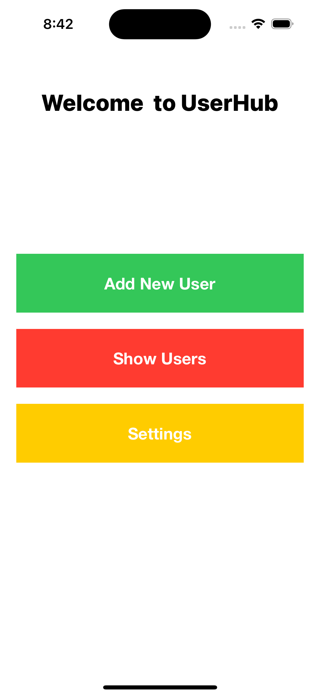

# UserHub
# 👤 UserHub – Mini User Manager App (iOS | UIKit)

> A simple educational app built with Swift and UIKit.  
It focuses on essential iOS development concepts like screen navigation, Auto Layout, Stack Views, IBOutlet/IBAction, and passing data between ViewControllers.

---

## 🧠 App Idea

This app includes multiple screens and allows you to:
- Add a user (name + email)
- View user details
- Navigate between screens using `present` and `push`
- Build responsive designs using Auto Layout and Stack Views

---

## 📱 Main Screens

### 1️⃣ HomeViewController
- The main screen contains 3 buttons:
  - ➕ Add New User  
  - 👤 Show User Details  
  - ⚙️ Settings
- Buttons are arranged using a `UIStackView` and Auto Layout

---

### 2️⃣ AddUserViewController
- A form to input user data:
  - `UITextField` for name  
  - `UITextField` for email  
  - `UIButton` to save

- On "Save", data is passed to the details screen using downcasting and `present`.

---

### 3️⃣ UserDetailsViewController
- Receives data from AddUser screen and displays it in `UILabels`.

```swift
// Example of passing data
let detailsVC = storyboard.instantiateViewController(withIdentifier: "UserDetailsViewController") as! UserDetailsViewController
detailsVC.userName = nameTextField.text
detailsVC.userEmail = emailTextField.text
present(detailsVC, animated: true)
```

---

### 4️⃣ SettingsViewController
- A side screen that shows:
  - App name
  - App version
  - A button to go back to Home

---

## 💡 Concepts Used

| Feature                                | Implemented?                  |
| ------------------------------------- | ----------------------------- |
| ✅ Auto Layout                         | ✔️                            |
| ✅ Stack Views                         | ✔️                            |
| ✅ IBOutlet / IBAction                 | ✔️                            |
| ✅ Screen Navigation                   | ✔️ Using `present()`          |
| ✅ Identity Inspector + Custom Class   | ✔️                            |
| ❌ UITableView                         | 🚧 Not used yet (not learned) |

---

## 🧪 How Data Passing Works

- Data is taken from `UITextField` in `AddUserViewController`
- Passed as `String?` to public variables in `UserDetailsViewController`
- Displayed inside `UILabels` in `viewDidLoad()`

---

## 🎥 Demo Video

[](./demo/VideoRun.mp4)

---

## 🛠️ Requirements

- Xcode 15 or later  
- iOS 15.0+  
- No internet or third-party libraries required

---

## 📚 What I Learned

- How to navigate between screens using `Storyboard ID`
- How to work with `IBOutlet` and `IBAction`
- How to use `UIStackView` with Auto Layout
- How to structure code in multiple ViewControllers
- How to pass data using `present()` and `downcasting`

---

## 👨‍💻 Developed by

> 💬 **Beshoy Atef Bahig**  
> Computer Science Graduate – Self-training project to improve UIKit skills

---

## 🔜 Coming Soon...

- ✅ Display users in `UITableView`  
- ✅ Edit user data  
- ✅ Delete user  
- ✅ Save data using `UserDefaults` or `CoreData`

---


